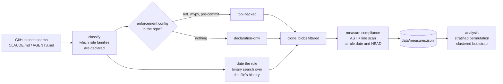

# Do the rules in CLAUDE.md and AGENTS.md change anything?

Repositories now ship a plain-text file telling an AI coding assistant how to behave in that project. People treat it as governance: write the rule down, the assistant follows it. This measures whether that holds, across **753 rules in 410 public Python repositories**.

Compliance is computed by walking the Python AST and scanning lines at two revisions: the commit where the rule first appears, and HEAD. No language model scores anything, so every figure is reproducible from the committed data.

```console
$ pip install -e .
$ policyprop report
instances 753  repositories 410
ceremonial (>= 90% compliance already) 66.7%
mean baseline compliance 86.2%

prescriptive instances 251
  headroom captured, tool-backed      +10.21%
  headroom captured, declaration-only +3.64%
  contact, tool-backed      0.472
  contact, declaration-only 0.516

difference +0.0657  stratified permutation p = 0.0219
95% clustered bootstrap interval [+0.0071, +0.1255]
```

## What it found

**Two thirds of rules describe code that already complied.** It depends on the family:

| rule family | instances | compliance before the rule | already at ceiling | change after |
|---|---|---|---|---|
| line length | 255 | 97.1% | 98% | −0.05 pts |
| type annotations | 393 | 83.6% | 56% | +1.45 pts |
| docstrings | 105 | 69.2% | 30% | +1.63 pts |
| all | 753 | 86.2% | 67% | +0.97 pts |

Line-length rules are ceremony. Docstring rules are not. An evaluation that treats "rule present" as an intervention averages the two and concludes instruction files do nothing.

**Among rules that did ask for change, enforcement beats prose.** Restricted to the 251 instances declared below ceiling:

| | tool-backed (142) | declaration-only (109) | p |
|---|---|---|---|
| share of files edited after the rule | 0.472 | 0.516 | 0.38 |
| share of the remaining gap closed | 10.21% | 3.64% | **0.022** |

Both arms opened a similar share of their files. The difference is what happened once a file was open: a formatter or type checker applies the rule to whatever passes through it, while an assistant editing a file for an unrelated reason usually leaves a prose rule unapplied.

p-values come from 20,000 permutations with labels shuffled inside each rule family, because the arms do not contain the same mix of families. The bootstrap resamples whole repositories, since one repository contributes several instances.

## How it works



A rule's date comes from a binary search over the instruction file's revisions, which is O(log n) blob fetches instead of one per revision. Measurement extracts each revision as a single tar via `git archive` rather than one `git show` per file; that change alone took a full pass from hours to minutes.

## Install and run

Python 3.11+, no third-party dependencies for the analysis.

```bash
pip install -e .
policyprop report                 # all figures
policyprop verify                 # recompute and fail if any disagrees with the paper
pytest                            # 33 tests
```

Re-running collection needs an authenticated `gh` CLI and hits live GitHub:

```bash
python pipeline/01_discover_classify.py    # search + classify + date rules
python pipeline/02_measure.py              # clone and measure
```

## Layout

| path | what |
|---|---|
| `data/measures.jsonl` | one record per rule instance: repo, family, tool-backed, rule date, compliance before and after, split by edited and unedited files |
| `data/classified_repos.jsonl` | the classified corpus. 24 records marked `reconstructed_from_measures` were rebuilt after their original classification file was lost; their instruction-file path is unknown |
| `src/policyprop/metrics.py` | the three compliance metrics |
| `src/policyprop/analysis.py` | pooling, permutation test, clustered bootstrap |
| `pipeline/` | collection scripts |
| `docs/DESIGN.md` | two measurement designs that look right and are not |

## Limitations

- **Observational.** Repositories that configure linters differ from those that do not in ways the data cannot see. Read the coefficient as the difference between projects that mechanise policy and projects that do not.
- **Skewed.** Median headroom captured is 0.81% tool-backed against 0.00% declaration-only, so a minority of instances drives the means. The clustered bootstrap is the more trustworthy of the two procedures.
- **Selection.** The three measurable families are exactly those for which enforcement tooling already exists.
- **Rule detection is pattern matching** over prose and will both miss rules and over-fire.
- **Tool-backing means config is present**, not that CI runs it, and not that the config predates the rule.
- **Re-running collection will not reproduce the corpus**: repositories change and search results drift. The committed data is the corpus the results are computed on.

## Next

- Field test: offer enforcement config to repositories that declare a rule with nothing behind it, and measure what changes after it is merged. That turns an observational gap into an intervention.
- Extend beyond Python; the method needs only a deterministic per-file check.

## AI use

Yerkhat Takatbek chose the question, rejected weaker versions of it, and reviewed each result. An AI assistant wrote the collection and analysis code, ran it, searched the literature, and drafted the text. No figure was produced or adjusted by a model: every number comes from logged runs over public data, and `policyprop verify` recomputes them.

## License

Code MIT. Data CC BY 4.0, derived from public repositories; each repository's own license governs its contents.
